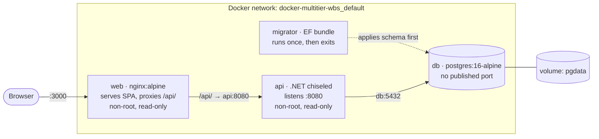

# Multi-Tier Application — Docker & Docker Compose

[](https://github.com/lrnt17/multi-tier-application/actions/workflows/ci.yml)

A three-tier application — React frontend, .NET API, PostgreSQL — containerized and orchestrated with Docker Compose. Starts with one command. Hardened, scanned, and gated behind a CI pipeline that has been verified to fail on bad commits.

---

## The problem this solves

"Works on my machine" is a symptom. Three things cause it:

**Onboarding cost.** A developer joining a project with a .NET API, a React frontend, and a Postgres backend spends one to three days installing the right SDK, the right Node version, a local Postgres, running migrations by hand, and discovering undocumented configuration. That is real money burned before a line of code is written.

**Environment parity failures.** Dev has Postgres 15, production runs 16. Dev has ICU globalization data installed, the server doesn't. These surface at deploy time — the most expensive moment to find them.

**Undeclared dependencies.** When environments are hand-built, nobody knows what the application actually requires. A Dockerfile is the only artifact that cannot lie about dependencies, because if it lied the build would fail.

This project replaces all of it with `docker compose up`.

---

## Architecture



**Startup order is enforced, not hoped for:**

1. `db` starts and is polled by a `pg_isready` health check until it genuinely accepts connections
2. `migrator` runs the EF Core migration bundle once and exits 0
3. `api` starts only after `service_completed_successfully` on the migrator
4. `web` serves the built SPA and proxies API calls

---

## Design decisions worth defending

### Frontend served by nginx, not Node

The React build is static files. Node is needed to *build* them and completely unnecessary to *serve* them. Shipping Node in the runtime image means shipping a build toolchain to production.

The nginx reverse proxy configuration also maps almost directly onto a Kubernetes Ingress later.

### `/api/` proxied through nginx, so CORS never arises

The frontend calls `/api/todos` — a relative path with no hostname. nginx forwards it to `api:8080`. Every request is same-origin, so there is no CORS configuration to maintain per environment and no API address baked into the frontend bundle.

### Migrations run as a one-shot job, never on API startup

The obvious approach — migrate when the API boots — works with one API container and corrupts quietly with two. Both instances see a missing schema and both start applying migrations concurrently.

A dedicated migrator service that runs once and exits removes the race entirely. It is also idempotent: EF Core records applied migrations in `__EFMigrationsHistory` and skips anything already present, so it is safe to run on every deploy.

This maps directly to a Kubernetes `Job` or `initContainer`.

### `/healthz` does not touch the database

Liveness answers "is this process alive and able to serve?" Readiness answers "should traffic be sent here right now?" Only readiness may check dependencies.

If `/healthz` queried Postgres, a database blip would convince an orchestrator that the *application* was dead — triggering a restart that fixes nothing and adds a cold start to an existing outage.

### The database publishes no host port

`ports:` exists to let traffic in from outside. Service-to-service traffic uses the private network and does not need it. Omitting it means nothing on the host — or the network the host is attached to — can reach Postgres directly.

---

## Security hardening

| Control | Implementation | Effect |
|---|---|---|
| Non-root | `USER 1654` (api), `USER 101` (web), numeric UIDs | An attacker with code execution is a nobody, not root |
| Read-only root filesystem | `read_only: true` + explicit `tmpfs` | Nothing can be written to disk, so nothing can be dropped and persisted |
| Dropped capabilities | `cap_drop: ALL` | The ~40 discrete root powers are all revoked; none were needed |
| No privilege escalation | `no-new-privileges:true` | Blocks setuid-binary escalation paths |
| Minimal base image | `aspnet:10.0-noble-chiseled` | No shell, no package manager — nothing for an attacker to run |
| Resource limits | `deploy.resources.limits` | One container cannot exhaust the host |
| No secrets in the repo | Gitignored `.env`, committed `.env.example` | Configuration travels separately from code |

Numeric UIDs rather than usernames because Kubernetes can enforce `runAsNonRoot` by inspecting a number; it cannot verify a name that only exists inside the image.

---

## Results

| Metric | Before | After |
|---|---|---|
| API image size | 359 MB (Debian `aspnet:10.0`) | 190 MB (chiseled) |
| Web image size | — | 26 MB (nginx:alpine runtime stage) |
| Build context | 36.04 MB | under 1 MB (after `.dockerignore`) |
| Rebuild after code-only change | full NuGet restore | restore layer `CACHED`, compile only |
| HIGH/CRITICAL CVEs, API image | — | 0 |
| Manual setup steps for a new developer | ~12 | 1 |

> **Note on measurement:** `docker images` and `docker compose images` report different figures for the same image (uncompressed disk footprint vs content size). Every number above is from `docker images`. Mixing the two produces a comparison that does not hold up.

---

## Prerequisites

- Docker Desktop (or Docker Engine + Compose v2)
- Git

Nothing else. No .NET SDK, no Node, no local Postgres.

---

## Setup

```bash
git clone https://github.com/lrnt17/multi-tier-application.git
cd multi-tier-application

cp .env.example .env      # then edit POSTGRES_PASSWORD

docker compose up -d --build
```

Open http://localhost:3000

---

## Verification

```bash
# every service healthy; migrator shows Exited (0)
docker compose ps -a

# API liveness — no database dependency
curl -i http://localhost:8000/healthz

# through the nginx proxy — same-origin, no CORS
curl -i http://localhost:3000/api/todos

# write path
curl -i -X POST http://localhost:8000/todos \
  -H "Content-Type: application/json" \
  -d '{"title":"verification","done":false}'
```

**Prove data persists across a restart:**

```bash
docker compose down        # containers removed, volume untouched
docker compose up -d
curl http://localhost:8000/api/todos    # your record is still there
```

**Prove the containers are hardened:**

```bash
docker compose exec api id                                    # uid=1654, not root
docker compose exec web sh -c "touch /usr/share/nginx/html/x" # read-only, refused
```

---

## Teardown

```bash
docker compose down        # stops and removes containers; DATA SURVIVES
docker compose down -v     # also destroys the volume; DATA IS GONE
```

Both commands delete the containers. Only the volume differs. `-v` is unrecoverable and has no confirmation prompt.

---

## CI pipeline

Runs on every push and pull request to `main`:

1. Build all images from a clean checkout
2. Trivy scan of both application images — fails on HIGH or CRITICAL
3. Gitleaks scan of full git history
4. Start the full stack with `--wait`
5. Smoke test: health, proxy path, and write path
6. Dump all logs on failure; tear down always

`main` is protected: pull request required, `build-and-smoke-test` required to pass, and bypassing is disabled for administrators.

**The pipeline has been verified to fail.** A deliberate broken `/healthz` was pushed on a branch; the run went red and the merge button was disabled. A pipeline that has only ever passed is untested — you cannot tell whether it is green because the code is good or because the checks are not really checking.

---

## Lessons learned

### Fast failure vs slow failure localises a fault before you read the error

- **Seconds** → you never reached the dependency. DNS, networking, service down, wrong port.
- **Milliseconds** → you reached it and it refused. Schema, permissions, credentials, bad query.

The same endpoint returned a 500 after 5.7s when the hostname did not resolve, and 200 in 1.7s once it did. Latency told the story before any log did.

### A green check is not proof of absence

Gitleaks reported "no leaks found." Two things were wrong with that.

First, `gitleaks-action` defaults to `--log-opts=-1` on push events — **one commit**, not the repository. After switching to run the binary directly with `--log-opts=--all` and `fetch-depth: 0`, it scanned all 20 commits.

Second, it *still* found nothing — while `git log -S "devpass"` proves a credential is in history. Gitleaks' default rules target high-entropy strings and known credential formats; a short dictionary word in a YAML file matches nothing.

**Scanners catch what they are built to catch.** Default rulesets are tuned to minimise false positives, which necessarily means missing things.

### A mount replaces what the image built there

`tmpfs` and volume mounts hide anything created at that path during the build. `mkdir -p /tmp/nginx` followed by `tmpfs: - /tmp` produces a directory that exists in the image and is unreachable at runtime. The same trap applies to `chown` — a fresh tmpfs arrives owned by root regardless of what the Dockerfile did.

Three distinct error codes distinguish the causes: `Read-only file system` (not writable at all), `13: Permission denied` (writable, wrong owner), `2: No such file or directory` (the mount hid it).

### `.dockerignore` is correctness, not hygiene

Without it, the host's `obj/` folder was copied over the one generated inside the container. `project.assets.json` records absolute paths from the machine that restored it — so a Linux SDK went looking for `C:\Program Files (x86)\Microsoft Visual Studio\Shared\NuGetPackages`. The error looked like a missing package and was not.

### Exit code 137 with empty logs is an OOM kill

SIGKILL cannot be caught, so the process has no opportunity to log its own death. **The silence is the signature.** Confirm from the host with `docker inspect --format "{{.State.OOMKilled}}"`, not from logs that will never contain it.

Reproduced deliberately by setting the API's memory limit to 8 MiB.

### Configuration that silently does nothing

`launchSettings.json` contained `ConnectionStrings__DefaultConnection` while the code reads `GetConnectionString("Default")`. The key had never worked — User Secrets had been supplying the value all along. Layered configuration means a misspelled key is invisible as long as some other provider supplies the right value. You find it when you remove the provider that was actually doing the work, often in a different environment at deploy time.

### A smaller image costs you your debugging tools

The chiseled base has no shell. `docker compose exec api sh` fails, by design. Three techniques replace it: read the logs, inspect from the host, and attach a throwaway container with tools to the same network. The mindset shift — from *machines you log into* to *processes you observe from outside* — is the one that scales.

### Known issue: credential in early git history

`devpass` appears in commits predating the `.env` migration. Assessed as non-exploitable: the value was only ever used against a local Postgres container that publishes no host port and is reachable only from inside the Compose network. It was never valid for any remote or shared system. The current working tree contains no credentials.

History was left unrewritten because the value is worthless and a partial rewrite had already demonstrated the risk. In production this would be a rotation, not a rewrite — rewriting history is never a substitute for changing the credential.

---

## Known gaps

- **No health check on the `api` service**, so `docker compose up --wait` does not gate on it. A broken API is caught by the smoke test rather than by `--wait`.
- **Postgres is not hardened** to the same standard as the application containers. Its writable-path requirements are more involved than the time available allowed.
- **`libgssapi_krb5.so.2` warnings** in API and migrator logs. Npgsql attempts to load Kerberos libraries for GSSAPI authentication; the chiseled image does not include them, so it falls back to password auth. Harmless, but it is log noise created by the smaller base image.
